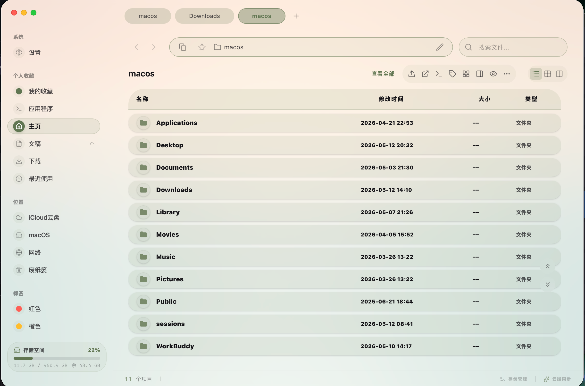
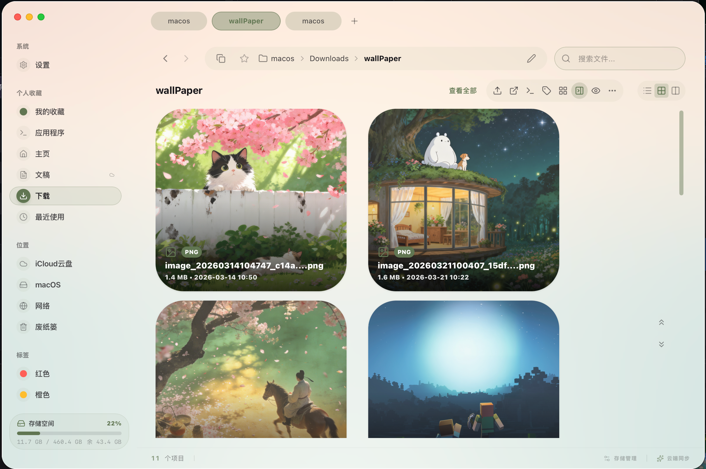
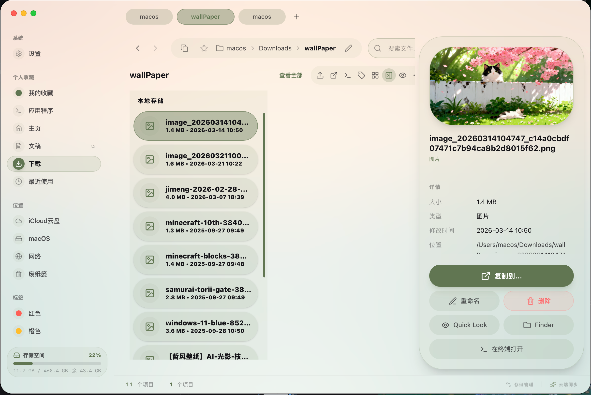
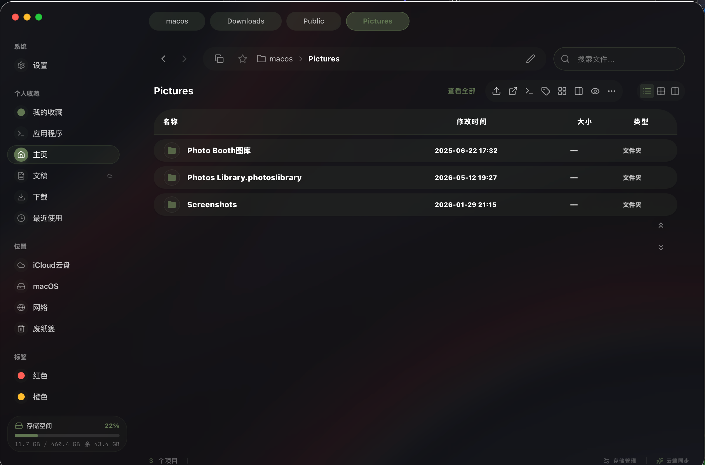
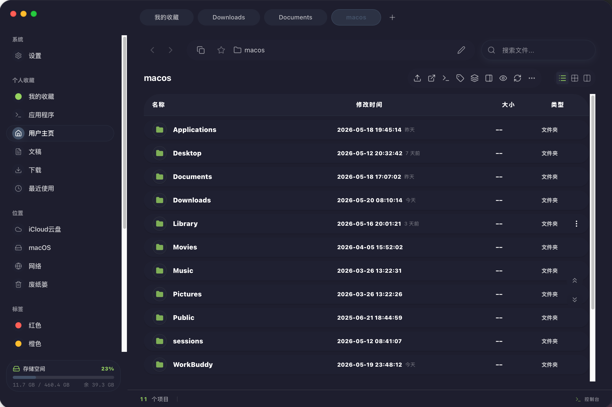

# Aether Explorer

A local-first macOS file workspace built with Tauri v2 + React 19 + Rust.
It is positioned as a Finder enhancement tool, not a replacement for the system file manager.

<p align="center">
  <strong>Casual follow, fateful updates</strong>
</p>

## Team

| Role | |
|------|-----|
| Captain | HaoRanQi |
| Designer | Gemini |
| Code Contributors | DeepSeek · Claude · GPT |

## Screenshots

### Light Mode

| List View | Grid View | Column View |
|:---:|:---:|:---:|
|  |  |  |

### Dark Mode



### Settings



## Features

### File Browsing
- Real filesystem operations — browse, open, copy, move, rename, delete (to Trash)
- Three view modes — List, Grid, Miller Columns, with adjustable layout parameters
- File preview — image thumbnails, PDF first page, video thumbnail and duration, text preview, Quick Look (Space key)
- Search & sort — real-time filtering, multi-column sorting, group by type/date

### macOS Deep Integration
- Native feel — frosted glass blur, light/dark/auto theme, 6 accent colors
- Quick Look — Space key triggers system native preview
- Trash — delete moves to Trash only, no physical deletion
- Terminal integration — open in Terminal via right-click, supports Terminal/iTerm etc.
- Full Disk Access — permission guidance and structured error messages

### Windows & Tabs
- Multi-window — Cmd+N new window, cross-window tab drag & drop
- Tab management — detach, merge across windows, close protection, Cmd+W close tab
- Wallpaper background — custom URL or local image, adjustable blur

### Settings & Customization
- Appearance — theme mode, accent color, font, transparency, blur intensity
- Context menu — configurable extensions with custom terminal commands
- Language — Chinese/English, default Chinese
- Operation history (AI + file actions) — true pagination, search by date/filename, configurable retention (default 7 days, max 90 days)

## Known Limitations

- Transfer manager now uses real background tasks, progress, cancellation, and conflict summaries; system notifications and extreme-directory performance still need polish
- Direct drag-out from Aether to Finder currently shows an explicit fallback; native drag-out requires a future pasteboard integration
- Very large directories still need chunked loading or chunked rendering for extreme cases
- External disk auto-refresh, Quick Access, and AirDrop entry points still need more work
- Column view sub-column cannot show preview panel ([BUG.md](./BUG.md))

Full task list at [TODO.md](./TODO.md).

## Tech Stack

| Layer | Technology |
|---|---|
| Desktop Framework | Tauri v2 |
| Frontend | React 19 + TypeScript |
| Build | Vite 6 |
| Styling | Tailwind CSS 4 |
| Animation | Motion (Framer Motion) |
| Backend | Rust |
| i18n | i18next |
| Storage | Tauri Store + localStorage |

## Quick Start

### Prerequisites
- macOS 12+
- Node.js 18+
- Rust toolchain ([rustup](https://rustup.rs))

### Development

```bash
npm install        # Install dependencies
npm run dev        # Start frontend dev server
npx tauri dev      # Start Tauri desktop app
```

### Build

```bash
npm run build      # Build frontend
npx tauri build    # Build macOS .app
```

Output at `src-tauri/target/release/bundle/`.

## Project Structure

```
aether-explorer/
├── src/                    # React Frontend
│   ├── components/         # UI Components
│   │   ├── TopBar.tsx      # Tab bar (drag, cross-window transfer)
│   │   ├── Sidebar.tsx     # Sidebar (navigation, favorites)
│   │   ├── ExplorerView.tsx # File view (list/grid/column)
│   │   ├── SettingsView.tsx # Settings panel
│   │   └── TransferModal.tsx # Transfer progress
│   ├── i18n/               # Internationalization (zh/en)
│   ├── types.ts            # Type definitions
│   ├── constants.ts        # Constants
│   └── App.tsx             # Root component
├── src-tauri/              # Rust Backend
│   ├── src/
│   │   ├── main.rs         # Entry point
│   │   ├── lib.rs          # Command registration
│   │   └── file_ops.rs     # Filesystem operations
│   └── tauri.conf.json     # Tauri config
├── assets/images/          # Screenshots
├── design/                 # Design resources
├── FEATURES.md             # Full feature list
├── TODO.md                 # Upcoming features
├── BUG.md                  # Known bugs
└── package.json
```

## Feature List

See [FEATURES.md](./FEATURES.md) for the full status table.

## Documentation Governance

- Codex index: [`codex/README.md`](./codex/README.md)
- Release workflow and acceptance: [`codex/06-release-runbook.md`](./codex/06-release-runbook.md)
- Liquid Glass and file workbench governance: [`codex/14-liquid-glass-file-workbench.md`](./codex/14-liquid-glass-file-workbench.md)
- Full-stack test report: [`docs/FULL_TEST_REPORT.md`](./docs/FULL_TEST_REPORT.md)

## Notes

- Delete operations only move files to macOS Trash, never physically delete
- Color tags are stored locally, not written to macOS extended attributes
- Privacy and outbound request notes are documented in [docs/PRIVACY.md](./docs/PRIVACY.md)
- Security reporting is documented in [SECURITY.md](./SECURITY.md), and contribution workflow is documented in [CONTRIBUTING.md](./CONTRIBUTING.md)

## Troubleshooting

### Opening unsigned builds

This project is maintained as a community, non-commercial distribution. Developer ID signing and notarization are intentionally not current roadmap blockers. When opening Aether Explorer for the first time, macOS may show "Aether Explorer.app is damaged and can't be opened" or block the unsigned app.

**Cause:** Current builds do not use Apple Developer code signing, so Gatekeeper treats them as unsigned apps.

**Recommended path:**

1. Open **System Settings → Privacy & Security**
2. Scroll down to the **Security** section
3. Click the **Open Anyway** button
4. Click **Open** in the confirmation dialog

**Advanced fallback:**

```bash
# Only run this after verifying the download source.
xattr -rd com.apple.quarantine /Applications/Aether\ Explorer.app
```

> Unsigned builds should not be presented as fully trusted signed distribution. Only download from the project release page, and test on a disposable folder before operating on important files.

## License

MIT
